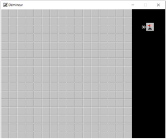
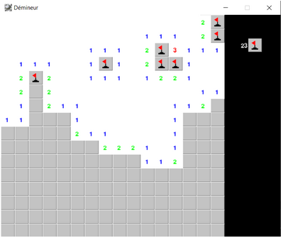

# Minesweeper
Simple minesweeper in Python using Pygame


## Requirements

- [Python 3.x](https://www.python.org)
- [Pygame](https://www.pygame.org)


## Usage

```bash
 py minesweeper.py
 ```

## Preview





